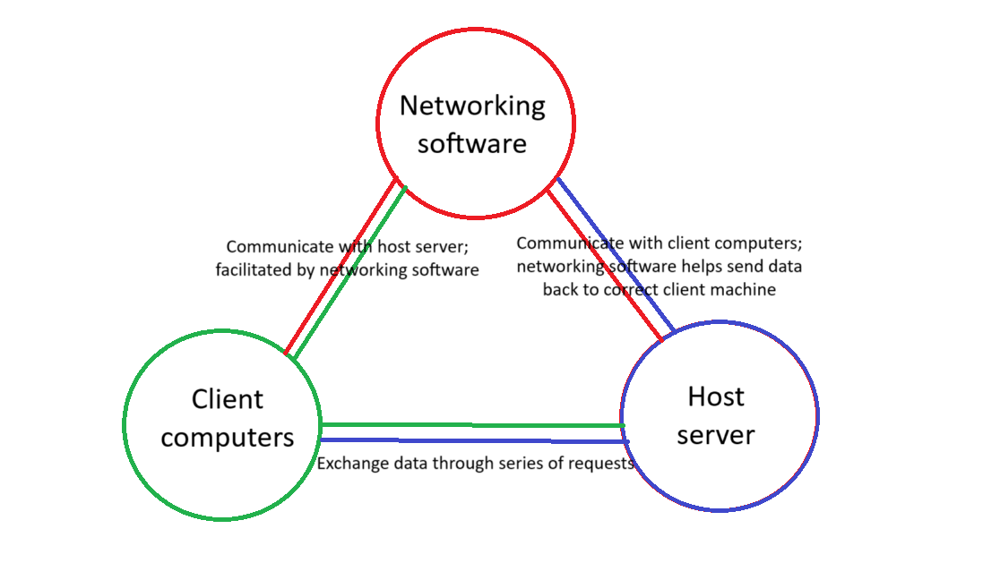

 # Nations Refounded - A Persistent-World Real-Time Strategy Game 
### Team Name (for GitHub as well): Broken Arrow Game Studio 
### Members: Jules Prater, Nic Dawson

## Intro
- Our project is called Nations Refounded, a multiplayer game in which players can build their own civilizations.
- Our motivation was to try to recreate an old game that was a lot of fun to play with added capabilities
- A few years ago, there used to be a game called [Nations](https://nationsgame.fandom.com/wiki/NationsGame), in which players form alliances and compete to build empires. However, Nations is now offline.
- While Nations Refounded is not a novel idea, it restores a currently-offline multiplayer game with added functionality.
- Nic is working on game design, while Jules is developing the networking and multiplayer capabilities

## Customer Value
Customer Need 
- Primary Customer - casual gamers on PC platforms
- Customer demand - These gamers are looking for a simple, entertaining game that they can play on limited hardware, such as low to mid level laptops
- Reason for demand - People get bored! These people need an enjoyable task to pass the time
- Market Context - Our game will combine and expand on proven concepts from several other games in the market

Proposed Solution
- From the customer’s POV, what will your solution deliver? - Nations Refounded will be a unique, easily accessible, group-oriented game that emphasizes daily engagement and out-of-game social interactions.
- How will the customer benefit from your proposed solution - While many casual games offer an easy pastime, they either lack enough content to be engaging over time (e.g. simple browser games that can be completed in a matter of hours) or do little to ensure a dynamic gameplay experience (e.g. Animal Crossing, where the game can feel like completing a list of chores at times). Our game will solve both of these issues by combining proven concepts from several different games, and we're aiming to create a game that offers more entertainment over a longer period of time.
- Does it provide a new capability or is it much better, easier, faster …? - We are drawing on several inspirations such as Animal Crossing, Helldivers, Clash of Clans, Sid Meier’s Civilization, and the original Nations to create a unique experience.
- Have you tested the idea on anyone? - While we have not pitched this idea to any customers, many of the games we are drawing inspiration from have been positively received; we are hoping to recreate this success while still offering an original experience.

Measures of Success
- Logins per day
- Total players
- Player retention rate after one month/year
- If customers are choosing to play and return to our game rather than others, we can assume we have given them a unique and engaging experience.

## Solution and Strategy
- Our software follows a client-server model, where connected computers are clients sending data to the central “server” computer, which will process the data and send the output back to the client machines. 
- The main components of Nations Refounded are the client computers, which connect to the server computer to access the game data, the server, which holds all of the data for each nation, and the networking software that connects them.

- The most minimal system that would have value to a customer is a program that players are able to log into to access a map consisting of linked nation nodes that are able to harvest food and natural resources, manufacture goods and have cities with inhabitants. The nations will be able to interact with each other and engage in travel, trade, and combat.
- All of the nations will be stored on a server thats holds the data for all of them and updates it in real time.
- Possible enhancements could include in-game money being produced on its own by taxes, rare resources and complex products, and water sources such as oceans
- We will be developing and testing the game using Godot, as it’s a language we all have some experience with and it was created specifically for game development. Additionally, Godot has a lot of networking capabilities that facilitate computer-to-computer communication.

## Team
Skills
We’ve already worked together in CS302 to develop a Godot based game. Additionally, Nic has hardware management skills that will be used to setup and manage our host server, and Jules has advanced networking skills that will aid in building the multiplayer aspect of our game.

Roles
- Nic - Main Godot development, game design, and hardware management
- Jules - Networking specialist and Godot development

Fixed roles - we want to make sure we each focus on tasks that work with our skill-sets to maximize development efficiency

## Project Management
- Completion of the system is feasible, and we plan to meet face-to-face on Thursdays.
- There are no regulatory or legal constraints or ethical or social concerns.
- We have access to all the data and resources we need.
- If the full functionality can’t be implemented, it’ll still operate and be a fun game, but it wouldn’t include all the original functions planned.

# Tentative project schedule - try to have each task done by the end of the week they’re listed in
## Sprint 1
Week 1: Feb 17 - 21
- Set up hardware, get teamviewer running - Nic
- Further discuss game/system design - Both
- Working camera (pan and zoom), and very basic map with terrain types (mountains, forest, plains, river, ocean) - Nic
- Begin resource node framework? - Nic
- Establish very basic multiplayer framework (be able to send a string to and from the host machine and a client machine) - Jules

Week 2: Feb 24 - 28
- Working resource nodes (no factories/extractors yet) - Nic
- Unit framework? - Nic
- Event framework to handle time-based events - Nic
- Network interface that can send player actions to and get game updates from the host machine - Nic

## Sprint 2
Week 3: Mar 3 - 7

– True multiplayer week –
- Username/password system to verify players - Jules
- Interface to start game with player sign-up - Jules
- Certain players can only see/control certain elements in the game (ie. players can only control units they own, UI shows correct player’s stats/resources) - Nic

Week 4: Mar 10 - 14
– Finish multiplayer by end of week if nothing else –
- Pioneer unit and cities implemented (all bullet points under cities listed above should be completed except city conquering) - Nic
- Factories and extractors working with correct resources being produced/consumed - Jules

## Sprint 3 and beyond?
Week 5: Mar 3 - 7
- Catch-up week to finish previous goals and fix technical debt
- Finish combat system… add several different types of units and add city conquering system
- Game balance
- Discuss stretch ideas

