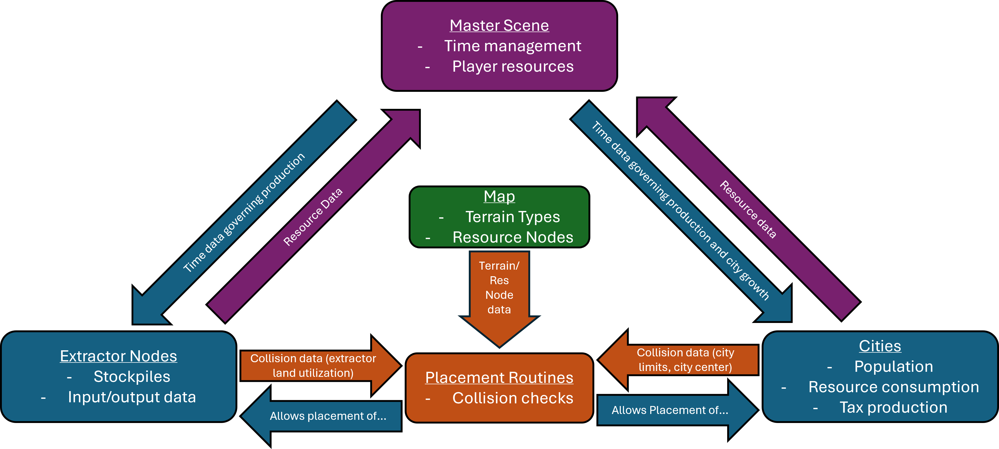

# Nations Refounded
### Team Name (for GitHub as well): Broken Arrow Game Studio 
### Members: Jules Prater, Nic Dawson

## Intro
Nations Refounded is a resource management and colonization RTS game where players build cities on a resource-rich continent.

### Motivation
During high school, there used to be a web-based multiplayer game called [Nations](https://nationsgame.fandom.com/wiki/NationsGame), where players would manage their resources, grow their influence, and conquer other players using military might. However, the original Nations was taken offline by the creator and disappeared without a trace. We aimed to revive and expand on this game's core concepts.

We built our project using Godot's 2d game engine - a system we both had experience in before. Nic was tasked with completing the main game design while Jules was tasked with developing our network and multiplayer functionalities. Due to complications during development, we had to scale back on our original idea, including scrapping our multiplayer functionality and the military aspect of the game. Despite this, we were still able to deliver a functional game by utilizing the frameworks we had already built and modifying the concept from a multiplayer-based game to a singleplayer experience.

## Customer Value
No changes - while the scope of our project changed from our original vision, our final project still targets the same market for the same reasons.

## Technology
Due to the fact that our planned multiplayer architecture was not completed, this will discuss the relationships/implementation of aspects within our game.

### Architecture

The main communication between game objects is done via a master scene, which handles time management, player data, and node loading/deloading. Cities and extractors -- despite serving different functions in the game -- are functionally similar; they contain stockpile (stored resources) and input/output data, and the time data from the master node is used to govern the rate of production. This consumption and production data is sent to the master node to modify the player's overall resource counts.

Placement routines (cityPlacementUI.tscn and extractorPlacementUI.tscn) are used to place game objects. Once a player presses "build" for a city or extractor, the placement routine performs collision checks on nearby cities, extractors, and map data to determine if the placement of the specified object is valid. If the placement is valid and the user clicks again, the placement routine node is deloaded and the correct game object is loaded in it's place.

### Changes from status reports
Aside from the scrapped aspects (military units and multiplayer), nothing has changed from the original concept.

## Testing
While no closed alpha tests have been done, stress testing of the game's architecture (spawning high numbers of cities, extractors, resource nodes on a highly complex map) have shown that the current system is able to handle more game objects than what could be feasibly placed by a player. Bug testing was done on an iterative process; once a new feature was added, the feature was tested for any adverse interactions with already-implemented systems. 

## Team
Our team utilized static roles; Nic's planned role in the project was the main game development and design in Godot and hardware management for the planned host server, and Jules' planned contribution was the networking aspect of our game as well as additional game development. However, Jules did not contribute to the project meanignfully since the project preposal and did not complete assigned tasks. 

## Project Management
The aforementioned non-contribution led to our original vision for this project not being fully realized. During the final week of the project, we had to pivot and use what we had to create a singleplayer experience rather than the planned multiplayer game. 

## Reflection
####Aspects that went well
- Issue tracking - Bugs and tasks were clearly notated in Github's issue tracker, and commits were clearly labelled and documented.
- Iterative process for testing and development - While implementing features, I would go back and analyze how they would interact with other systems and update the project accordingly.

####Aspects that did not go well
- Task scope - While defining certain tasks, I realized that some aspects of the task (UI specifically) were not considered when planning sprints, leading to an unpredictable workload week-to-week.
- Team management - Communication breakdown and non-contribution led to an extremely late pivot and a rushed final product.

####Overall
Despite our shortcomings, I still would consider this project a success. Project-wise, we were able to deliver a singleplayer experience with many of the promised features, and the frameworks that we developed can still be expanded to realize our original vision for this game. Personally, I set out to learn more about game development, Godot's ecosystem, and best practices for software development; while I wish I could've learned more about healthy collaboration, I gained valueable experience and furthered my knowledge in all the other areas listed.
