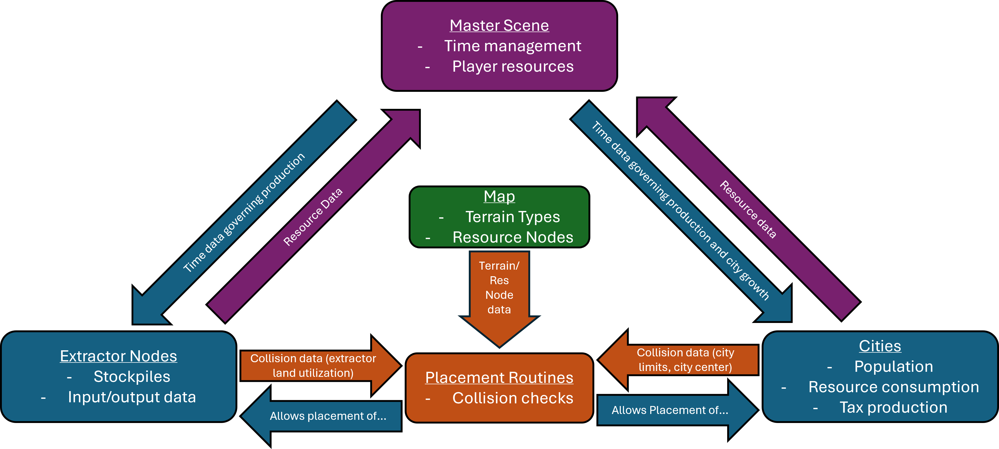

# Nations Refounded - Explore, Expand, Exploit

# Intro
Nations Refounded is a resource management and colonization RTS game where players build cities on a resource-rich continent.

# Installing/running
Nations Refound can be downloaded by clicking this [link](https://github.com/Novation257/Nations-Refounded/blob/main/Releases/Nations%20Refounded%200.1.1.zip), then selecting download from the three-dot menu in the top right. Extract the zip folder's contents (the exe and pck files must be in the same folder), and run the exe to start the game. Nations Refounded *should* be compatible with modern Windows and Mac machines.

# How to play
The game revolves around growing your influence and producing as many resources as possible in order to support your growing population. Balancing your growth and production numbers is a skill that must be learned throughout the game.

### Resources
Resources are the materials you need to build and maintain your nation. Your current available resources can be viewed in the top left corner. Buildings that produce and consume resources do so in a unit called a **stockpile**. One stockpile represents the production capability of a building over one time unit. Buildings can only hold so many stockpiles, so they must be collected periodically (by clicking on them).

### The Map
Modelled after a real island off of the Northern coast of Australia, the map is home to several abundant natural resources for you to extract. Each **terrain type** (Barren, plains, forest, mountains, river and ocean) offers unique resources that can be farmed using various extractors. **Resource nodes** are rare concentrations of valuable resources that can be found scattered on the map; each type of resource node has a special extractor that offers high yields when placed by one of these nodes.

**UI** - You can pan around the map by right clicking and dragging, and you can zoom in/out using the scroll wheel (two finger up/down gesture with trackpad)

### Cities
Cities are your way of growing your influence on the map. Each city has a **sphere of influence (SOI)** that allows you to place resource extractors within it. When a city is founding, the city's SOI starts off relatively small. However, your city's SOI can be grown over time by growing your **population**.

Cities produce money through taxes. The more citizens you have in your city, the more tax revenue they will produce. However, cities need two resources:
- Food - All cities consume food in accordance to their population. If you run out of available food, your city will begin to starve; your population will start dying off and tax production is halted until the issue is resolved.
- Consumer Goods - Larger cities will also consume consumer goods in order to keep them happy. If this need is not met, tax production will be reduced

**UI** - Population is shown as the left number under your city name, while the tax stockpile is shown on the right. If the tax display is red, there is an issue preventing tax production (usually stockpiles are full or the city is starving). If the number is yellow, you're generating taxes at a reduced rate due to a lack of consumer goods. Hovering the mouse over the city displays extra stats.

**Building** - Cities can be built using the City button and must be placed on either barren terrain or plains. They cannot be placed either extremely close nor extremely far from your other cities.

### Extractors
Extractors are how you produce resources from the land. All extractors have five main stats:
- Terrain type: the terrain type the extractor must be placed on (ie. a sawmill must be placed on forest terrain)
- Construction cost: the resources required in order to place the extractor
- Consumption: the resources the extractor will consume per stockpile generated
- Production: the resources the extractor will produce per stockpile generated
- Resource node (for specialized extractors): the resource node the extractor must be placed near

**UI** - The number displayed on the extractor is the extractor's current stockpile count. If this number is red, the extractor's stockpiles are full. Hovering the mouse over the city displays extra stats.

**Building** - Extractors can be built by clicking the Build button. They must be built within the SOI of a city and cannot overlap another extractor or a city center. Keep in mind that each extractor has its own special requirements for construction as mentioned above.

### Quick Start
1. Place a city that's close to a food-bearing resource node, has ample forest area to build sawmills, and plains to place windmills on.
2. Place down an extractor to harvest the food-bearing resource node. Place at least one windmill and at least one sawmill.
3. Collect your taxes and production stockpiles periodically.
4. Keep an eye on your resources, and build extra extractors as needed.
5. When possible, found another city close to resource nodes you need. For example, if you're constantly running low on power, try to find a coal node and found a city close to there.

# Vision statement
This project remains incomplete from my original vision; I set out on this project looking to add more multiplayer and competitive aspects such as city conquering, military units and combat, and a resource trading system. However, due to a lack of time the original team for this project could put into this game, my original goals for this sat unrealized. While I want to continue development of this game in the future, I won't be putting more effort into this until I have the time to do so.

## Bugs/inconsistencies:
- In order to scroll through UI elements like the build menu, you must hold the shift key in order to prevent zooming
- There is some odd behavior when the game is doing terrain checks around rivers; the collider for the river seems to be inconsistent with its visual representation

# Writeup (for CS340)

### Motivation
During high school, there used to be a web-based multiplayer game called [Nations](https://nationsgame.fandom.com/wiki/NationsGame), where players would manage their resources, grow their influence, and conquer other players using military might. However, the original Nations was taken offline by the creator and disappeared without a trace. We aimed to revive and expand on this game's core concepts.

We built our project using Godot's 2d game engine - a system we both had experience in before. Nic was tasked with completing the main game design while Jules was tasked with developing our network and multiplayer functionalities. Due to complications during development, we had to scale back on our original idea, including scrapping our multiplayer functionality and the military aspect of the game. Despite this, we were still able to deliver a functional game by utilizing the frameworks we had already built and modifying the concept from a multiplayer-based game to a singleplayer experience.

## Customer Value
No changes - while the scope of our project changed from our original vision, our final project still targets the same market for the same reasons.

## Technology
Due to the fact that our planned multiplayer architecture was not completed, this will discuss the relationships/implementation of aspects within our game.

### Architecture

The main communication between game objects is done via a master scene, which handles time management, player data, and node loading/deloading. Cities and extractors -- despite serving different functions in the game -- are functionally similar; they contain stockpile (stored resources) and input/output data, and the time data from the master node is used to govern the rate of production. This consumption and production data is sent to the master node to modify the player's overall resource counts.

Placement routines (cityPlacementUI.tscn and extractorPlacementUI.tscn) are used to place game objects. Once a player presses "build" for a city or extractor, the placement routine performs collision checks on nearby cities, extractors, and map data to determine if the placement of the specified object is valid. If the placement is valid and the user clicks again, the placement routine node is deloaded and the correct game object is loaded in it's place.

### Changes from status reports
Aside from the scrapped aspects (military units and multiplayer), nothing has changed from the original concept.

## Testing
While no closed alpha tests have been done, stress testing of the game's architecture (spawning high numbers of cities, extractors, resource nodes on a highly complex map) have shown that the current system is able to handle more game objects than what could be feasibly placed by a player. Bug testing was done on an iterative process; once a new feature was added, the feature was tested for any adverse interactions with already-implemented systems. 

## Team
Our team utilized static roles; Nic's planned role in the project was the main game development and design in Godot and hardware management for the planned host server, and Jules' planned contribution was the networking aspect of our game as well as additional game development. However, Jules did not contribute to the project meanignfully since the project preposal and did not complete assigned tasks. 

## Project Management
The aforementioned non-contribution led to our original vision for this project not being fully realized. During the final week of the project, we had to pivot and use what we had to create a singleplayer experience rather than the planned multiplayer game. 

## Reflection
#### Aspects that went well
- Issue tracking - Bugs and tasks were clearly notated in Github's issue tracker, and commits were clearly labelled and documented.
- Iterative process for testing and development - While implementing features, I would go back and analyze how they would interact with other systems and update the project accordingly.

#### Aspects that did not go well
- Task scope - While defining certain tasks, I realized that some aspects of the task (UI specifically) were not considered when planning sprints, leading to an unpredictable workload week-to-week.
- Team management - Communication breakdown and non-contribution led to an extremely late pivot and a rushed final product.

#### Overall
Despite our shortcomings, I still would consider this project a success. Project-wise, we were able to deliver a singleplayer experience with many of the promised features, and the frameworks that we developed can still be expanded to realize our original vision for this game. Personally, I set out to learn more about game development, Godot's ecosystem, and best practices for software development; while I wish I could've learned more about healthy collaboration, I gained valuable experience and furthered my knowledge in all the other areas listed.
